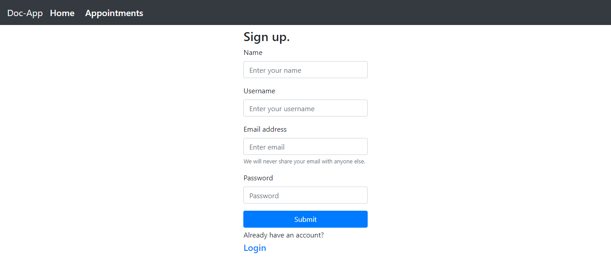
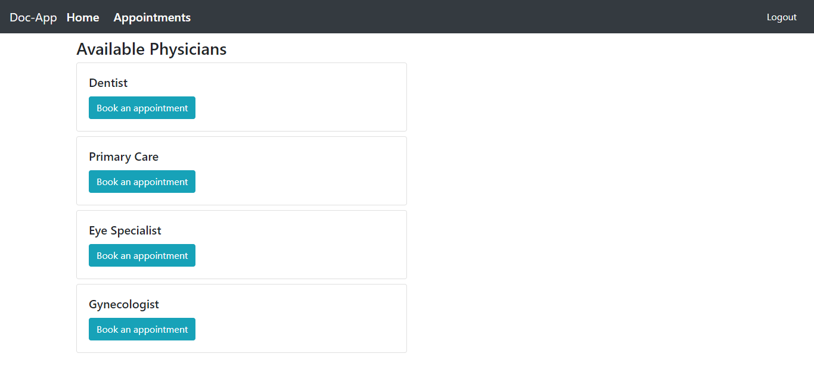
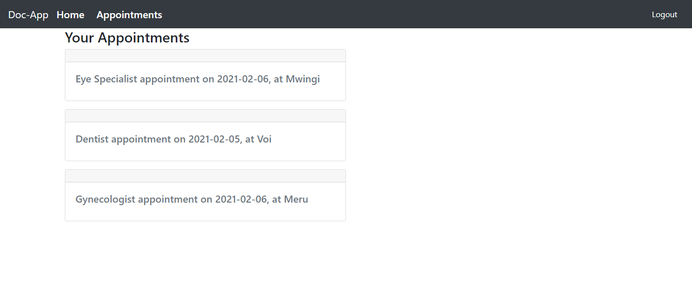

# Book A Physician

## Project description
An application for creating doctor appointments. It uses an API endpoint built using Rails

## Screenshot






## Built with
- Javascript
- react-bootstrap
- Node.js
- React.js
- Redux

## Live Demo link
[book-a-physician](https://book-a-physician.herokuapp.com/)


## Getting Started

To get a local copy up and running follow these simple example steps.

## Prerequisites

- Install node.

## Set up

- Clone the project.
- Cd into the project directory.
- Run ```yarn install``` to install dependencies in package.json.
- Run ```npm start``` and view the page on your localhost.
- Run ```npm test``` to view tests.


## Contributions

 If you see something wrong or not working, please check [the issue tracker section](https://github.com/blackpintz/physician-appointment/issues), if that problem you met is not in already opened issues then open a new issue by clicking on `new issue` button.

## Author

👤 **Rose Wanjohi**
- Github: [@blackpintz](https://github.com/blackpintz)
- Twitter: [@blackpintz](https://twitter.com/blackpintz)
- Linked: [Rose Wanjohi](https://www.linkedin.com/in/rosewanjohi/)

## Acknowledgements

- [Microverse](https://www.microverse.org/)
- [Learnetto](https://learnetto.com/)

## Show your support

Give a ⭐️ if you like this project!
